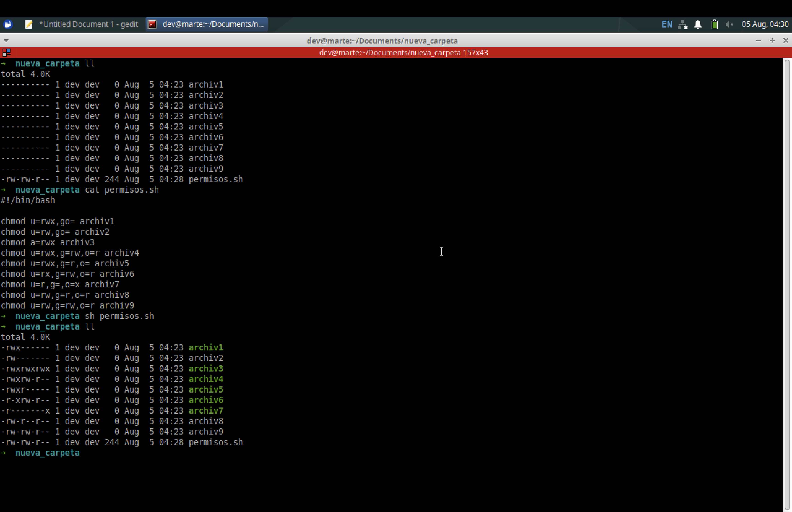
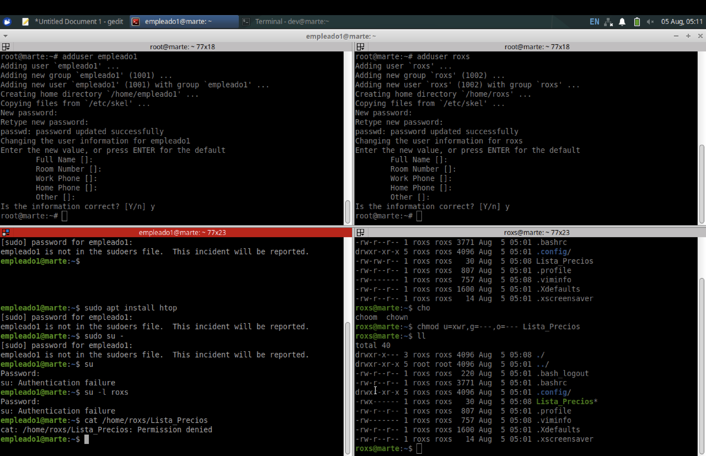

# Reto 2 - Linux - gestión de permisos

1. En un directorio vacío (nuevo), crear 9 archivos (archiv1, archiv2, etc.) utilizando el comando `touch`:

Solucion

---
 

2. Modifica los permisos usando el operador `=` del `chmod`, para que queden de la siguiente manera:

Solucion

---
 

3. Modificar los permisos de los archivos anteriores utilizando los operadores `+` y  `-` del `chmod` para que queden de la siguiente manera (Los cambios son relativos a los archivos del ejercicio anterior):

Solucion

---
 

4. **Problema propuesto** 
   
Roxs es la líder de un equipo de trabajo para una compañía que realiza Auditorías Externas. Él ha creado un archivo llamado *Lista_Precios* en su directorio `/home`. El archivo es altamente confidencial, pero resulta que existe un alto riesgo de que su archivo  sea  vulnerado  porque  otros  empleados  utilizan  su  equipo  al  finalizar  su turno.   Actualmente,   Roxs   posee   una   contraseña   segura,   pero   él   necesita resguardar los datos de ese archivo y no desea que nadie más que solamente él tenga acceso al mismo. ¿Qué solución le propondrían como equipo a Roxs? 

>1. Identificar las medidas de seguridad a implementarse. 
- Evitar el escalamiento de privilegios a los usuarios estándar
- Configurar usuarios separados para cada empleado
- Dar permisos correctos al archivo para cumplir con la premisa del enunciado
- Realizar backups periódicos del archivo
 

>2. Identificar el tipo de usuarios para quienes los permisos >serán cambiados.
- El aseguramiento de la máquina se realizará a nivel global, pero con el objetivo que solo el usuario roxs puede maniobrar el archivo home/roxs/Lista_precios 
 

>3. Identificar el tipo de permiso que necesita ser cambiado.
- Desde el usuario root crear usuarios separados estándar para cada empleado
- Crear el archivo home/roxs/Lista_precios desde el usuario de roxs
- Cambiar permisos del archivo
<pre>`chmod u=xwr,g=---,o=--- /home/roxs/Lista_precios`</pre>
 

>4. Verificar los permisos de acceso al archivo.
- A continuación se puede observar como aplicando los pasos de los puntos anteriores se puede tener seguridad en el archivo Lista_precios

Solucion

---
 

# Reto 3 - Linux - gestión de directorios

Solucion

